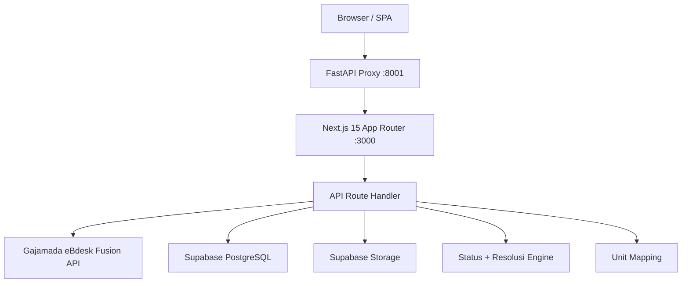

## Current State (2026-07-08 Simplification)

Arsitektur saat ini disederhanakan. Konten di bawah mendokumentasikan state historis dan tetap dibiarkan apa adanya sebagai arsip.

**Dihapus / tidak ada lagi:**
- ASTINA auto-sync (tidak ada push/pull otomatis ke ASTINA)
- ASTINA kredensial dan tabel terkait
- Document register / auto-numbering system
- Hardcoded unit list
- Integrasi AI (tidak ada Gemini / OpenCode / LLM apa pun)

**Ditambahkan / aktif sekarang:**
- Status + Resolusi Engine (`lib/status.js`) ??? 7 tahapan status, 4 resolusi, transition via `/status` dan `/resolusi`
- Unit Mapping (`lib/unit_mapping.js` + koleksi `unit_mapping`) ??? normalisasi nama unit Gajamada → SIMONDU saat fetch
- Role hierarchy baru: super_admin > kabid_propam > kasubbag_yanduan > kasubbid > unit > admin
- Terima kasus internal only (tidak ada push balik ke Gajamada saat unit menerima)
- 3-bucket UI: SURAT MASUK / DALAM PENANGANAN / SELESAI (dashboard ANEV)
- Fire-and-forget sync ke Gajamada tetap ada (background setelah mutasi tertentu), ASTINA sync dihapus

# System architecture

## Layers

## Data Source

- **Gajamada eBdesk Fusion**: source of truth untuk daftar kasus, detail, attachment, timeline, katalog unit
- **ASTINA manual input**: kasus yang tidak masuk dari Gajamada di-input manual oleh Kasubbag Yanduan
- **Tidak ada auto-sync ASTINA**, tidak ada AI/Gemini/OpenCode integration

## Komponen Utama

### Frontend (`page.js`, ~2500 lines)
Single-file SPA dengan navigasi internal tab state. Semua view: Dashboard ANEV (3-bucket KPI), Daftar Surat, Antrian Disposisi, Master Unit, Satker/Satwil, ASTINA Manual Input, Personel, Log Sync, Audit Log, Pengaturan.

### API Handler (`route.js`, ~2000 lines)
Catch-all API route ??? semua endpoint bisnis dalam satu file. Pattern: request.method + URL path dispatching. Menangani auth, CRUD, integrasi eksternal, upload, download, status transitions, resolusi.

### Integrasi Gajamada (`lib/gajamada.js`)
REST client untuk eBdesk Fusion API. Auto-login dengan session cookie, auto-retry 401. Endpoint yang di-reverse-engineer: daftar kasus, detail, attachment, timeline, katalog unit, gateway push, upload file.

### Status + Resolusi Engine (`lib/status.js`)
Mesin terpusat yang mendefinisikan 7 tahapan status, 3 bucket UI, dan 4 jenis resolusi. Semua perubahan status kasus melewati endpoint `/status` dan `/resolusi`. Status efektif di-derive dari overlay operasional lokal + data Gajamada.

**7 Tahapan Status:** SURAT_MASUK_POLDA_JABAR -> KASUBBAG_YANDUAN -> KABID_PROPAM -> UNIT -> SIDANG_DISIPLIN -> KASUBBAG_YANDUAN_VERIFIKASI -> SELESAI

**3 Bucket UI:** SURAT MASUK / DALAM PENANGANAN / SELESAI

**4 Resolusi:** PERDAMAIAN, RJ, TERBUKTI, TIDAK_TERBUKTI. Perdamaian dan RJ dapat diajukan di tahap mana pun kecuali SIDANG_DISIPLIN.

### Unit Mapping (`lib/unit_mapping.js` + koleksi `unit_mapping`)
Normalisasi nama unit dari Gajamada ke SIMONDU. Mapping otomatis saat fetch kasus dari Gajamada, memastikan kasus masuk ke unit yang benar meskipun nama di Gajamada tidak konsisten. Tidak ada hardcoded unit list.

### Backend Proxy (`backend/server.py`)
FastAPI reverse proxy di port 8001 meneruskan /api/* ke Next.js :3000. Health check endpoint.

## Database

Supabase PostgreSQL (sebelumnya MongoDB). Tabel utama: dispositions, timelines, followup_documents, sync_logs, audit_logs, units_master, completions, followup_checklist, case_outcomes, satker_satwil, local_cases, personel, user_credentials, app_settings, unit_mapping. ASTINA auto-sync, document register, numbering system, dan hardcoded unit list telah dihapus. Tidak ada AI/Gemini/OpenCode integration.

## Pola Arsitektur

- Single-file monolith (SPA + API catch-all) ??? dipilih untuk kecepatan MVP, akan di-dekomposisi
- Gajamada sebagai source of truth untuk daftar kasus dan detail ??? SIMONDU menyimpan overlay operasional (disposisi, status, dokumen follow-up, resolusi)
- Terima kasus internal only ??? tidak ada push ke Gajamada saat unit menerima kasus
- Fire-and-forget sync ke Gajamada ??? background sync setelah mutasi tertentu via setTimeout (ASTINA sync dihapus)
- Status kontekstual ??? semua transisi status melalui `/status` dan `/resolusi` dengan engine terpusat di `lib/status.js`
- 3-bucket UI ??? dashboard menampilkan SURAT MASUK / DALAM PENANGANAN / SELESAI
- Role hierarchy: super_admin > kabid_propam > kasubbag_yanduan > kasubbid > unit > admin
- Session JWT cookie ??? HS256, 7 hari, HttpOnly
- Per-user credentials ??? setiap user punya kredensial Gajamada sendiri di user_credentials (ASTINA kredensial dihapus)
