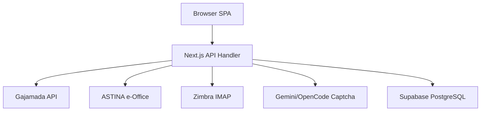

# System architecture

## Lapisan
1. **Presentation**: Next.js 15 SPA, React 18, Tailwind CSS, Radix UI
2. **Routing**: Tab-based state, catch-all API route
3. **Auth**: JWT jose, cookie session, 68 hardcoded users, role-based
4. **API**: Path+method dispatch, public routes before auth check
5. **Integrations**: Gajamada REST + session, ASTINA Bearer+OTP via Zimbra IMAP
6. **Database**: Supabase PostgreSQL via MongoDB-compatible adapter
7. **Background**: setInterval auto-refresh ASTINA, retry sync
