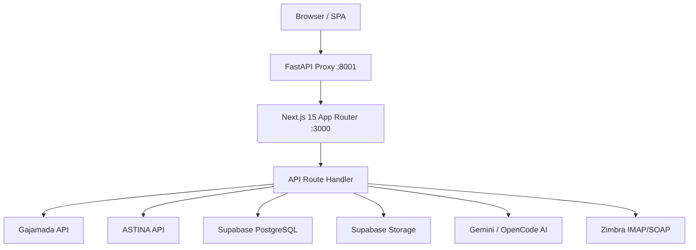

# System architecture

## Layers

## Komponen Utama

### Frontend (`page.js`, ~2500 lines)
Single-file SPA dengan navigasi internal tab state. Semua view: Dashboard ANEV, Daftar Surat, Antrian Disposisi, Master Unit, Satker/Satwil, Register Dokumen, Personel, Log Sync, Audit Log, Pengaturan.

### API Handler (`route.js`, ~2000 lines)
Catch-all API route ??? semua endpoint bisnis dalam satu file. Pattern: request.method + URL path dispatching. Menangani auth, CRUD, integrasi eksternal, upload, download.

### Integrasi Gajamada (`lib/gajamada.js`)
REST client untuk eBdesk Fusion API. Auto-login dengan session cookie, auto-retry 401. Endpoint yang di-reverse-engineer: daftar kasus, detail, attachment, timeline, katalog unit, gateway push, upload file.

### Integrasi ASTINA (`lib/astina-auth.js` + `lib/astina-client.js`)
Auto-login chain: Gemini Vision solves captcha -> password login -> Zimbra IMAP/SOAP fetch OTP -> validasi token. ASTINA client membungkus API e-Office: surat baru, surat masuk, riwayat disposisi, post disposisi.

### Backend Proxy (`backend/server.py`)
FastAPI reverse proxy di port 8001 meneruskan /api/* ke Next.js :3000. Health check endpoint.

## Database

Supabase PostgreSQL (sebelumnya MongoDB). 18+ tabel: dispositions, timelines, followup_documents, sync_logs, audit_logs, units_master, completions, followup_checklist, case_outcomes, satker_satwil, numbering_settings, local_cases, astina_sessions, document_register, personel, user_credentials, app_settings, unit_mapping.

## Pola Arsitektur

- Single-file monolith (SPA + API catch-all) ??? dipilih untuk kecepatan MVP, akan di-dekomposisi
- Gajamada sebagai source of truth ??? SIMONDU hanya menyimpan overlay operasional
- Fire-and-forget sync ??? background sync ke Gajamada/ASTINA setelah setiap mutasi via setTimeout
- Session JWT cookie ??? HS256, 7 hari, HttpOnly
- Per-user credentials ??? setiap user punya kredensial Gajamada + ASTINA sendiri di user_credentials
