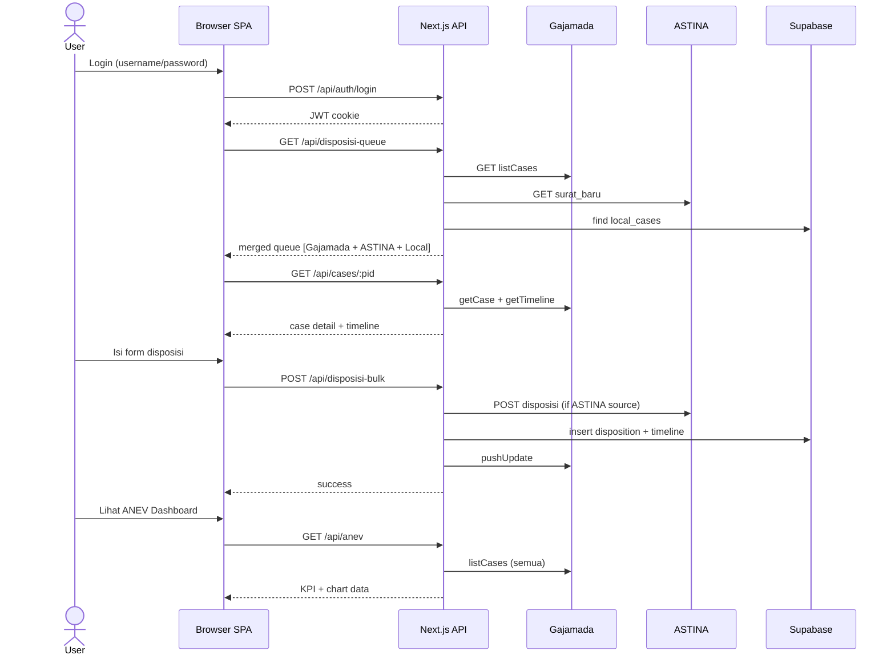

# Key flows

```mermaid
sequenceDiagram
    actor User
    participant Browser as Browser SPA
    participant API as Next.js API
    participant Gajamada as Gajamada
    participant ASTINA as ASTINA
    participant Supabase as Supabase

    User->>Browser: Login (username/password)
    Browser->>API: POST /api/auth/login
    API-->>Browser: JWT cookie

    Browser->>API: GET /api/disposisi-queue
    API->>Gajamada: GET listCases
    API->>ASTINA: GET surat_baru
    API->>Supabase: find local_cases
    API-->>Browser: merged queue [Gajamada + ASTINA + Local]

    Browser->>API: GET /api/cases/:pid
    API->>Gajamada: getCase + getTimeline
    API-->>Browser: case detail + timeline

    User->>Browser: Isi form disposisi
    Browser->>API: POST /api/disposisi-bulk
    API->>ASTINA: POST disposisi (if ASTINA source)
    API->>Supabase: insert disposition + timeline
    API->>Gajamada: pushUpdate
    API-->>Browser: success

    User->>Browser: Lihat ANEV Dashboard
    Browser->>API: GET /api/anev
    API->>Gajamada: listCases (semua)
    API-->>Browser: KPI + chart data
```
