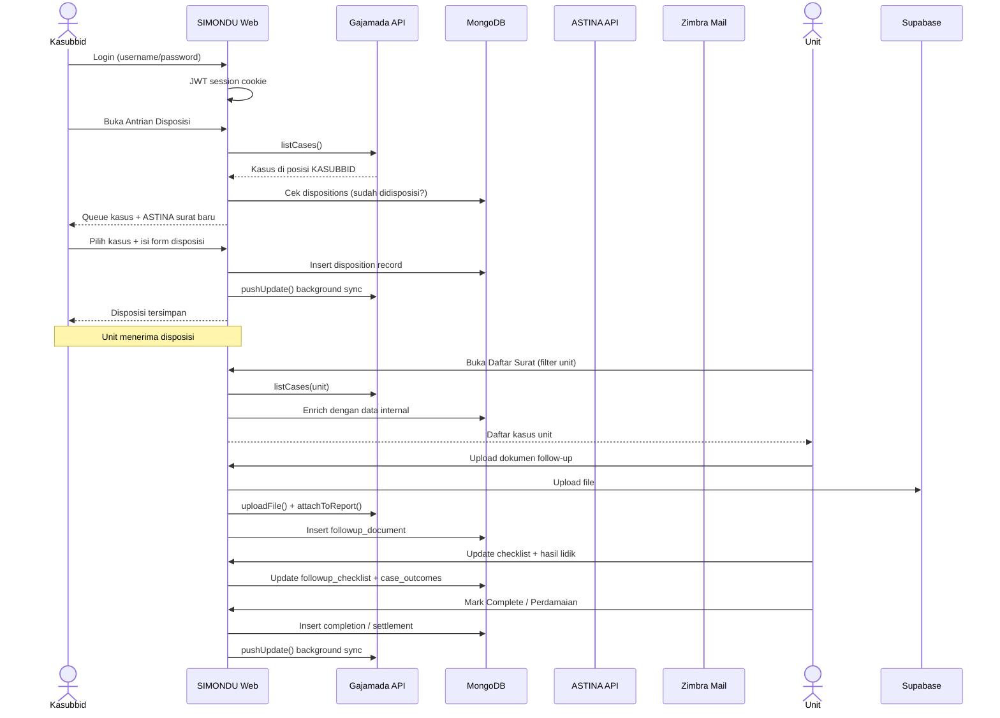
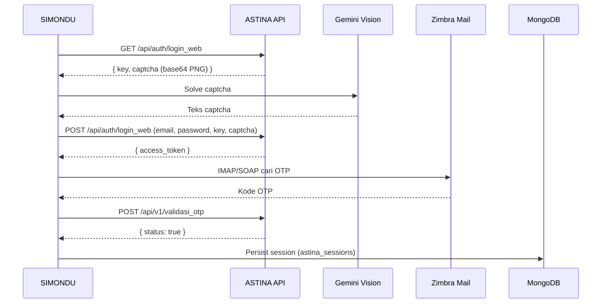
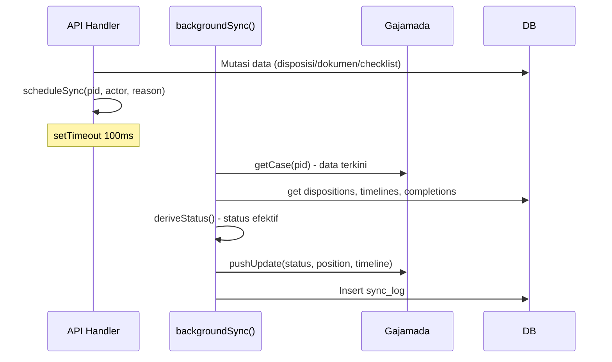

# Key flows

## Alur Disposisi (End-to-End)

```mermaid
sequenceDiagram
    actor Kasubbid
    participant SIMONDU as SIMONDU Web
    participant Gajamada as Gajamada API
    participant DB as MongoDB
    participant ASTINA as ASTINA API
    participant Zimbra as Zimbra Mail

    Kasubbid->>SIMONDU: Login (username/password)
    SIMONDU->>SIMONDU: JWT session cookie

    Kasubbid->>SIMONDU: Buka Antrian Disposisi
    SIMONDU->>Gajamada: listCases()
    Gajamada-->>SIMONDU: Kasus di posisi KASUBBID
    SIMONDU->>DB: Cek dispositions (sudah didisposisi?)
    SIMONDU-->>Kasubbid: Queue kasus + ASTINA surat baru

    Kasubbid->>SIMONDU: Pilih kasus + isi form disposisi
    SIMONDU->>DB: Insert disposition record
    SIMONDU->>Gajamada: pushUpdate() background sync
    SIMONDU-->>Kasubbid: Disposisi tersimpan

    Note over Kasubbid,SIMONDU: Unit menerima disposisi

    actor Unit
    Unit->>SIMONDU: Buka Daftar Surat (filter unit)
    SIMONDU->>Gajamada: listCases(unit)
    SIMONDU->>DB: Enrich dengan data internal
    SIMONDU-->>Unit: Daftar kasus unit

    Unit->>SIMONDU: Upload dokumen follow-up
    SIMONDU->>Supabase: Upload file
    SIMONDU->>Gajamada: uploadFile() + attachToReport()
    SIMONDU->>DB: Insert followup_document

    Unit->>SIMONDU: Update checklist + hasil lidik
    SIMONDU->>DB: Update followup_checklist + case_outcomes

    Unit->>SIMONDU: Mark Complete / Perdamaian
    SIMONDU->>DB: Insert completion / settlement
    SIMONDU->>Gajamada: pushUpdate() background sync
```

## Alur Login ASTINA

```mermaid
sequenceDiagram
    participant SIMONDU
    participant ASTINA as ASTINA API
    participant Gemini as Gemini Vision
    participant Zimbra as Zimbra Mail
    participant DB as MongoDB

    SIMONDU->>ASTINA: GET /api/auth/login_web
    ASTINA-->>SIMONDU: { key, captcha (base64 PNG) }

    SIMONDU->>Gemini: Solve captcha
    Gemini-->>SIMONDU: Teks captcha

    SIMONDU->>ASTINA: POST /api/auth/login_web (email, password, key, captcha)
    ASTINA-->>SIMONDU: { access_token }

    SIMONDU->>Zimbra: IMAP/SOAP cari OTP
    Zimbra-->>SIMONDU: Kode OTP

    SIMONDU->>ASTINA: POST /api/v1/validasi_otp
    ASTINA-->>SIMONDU: { status: true }

    SIMONDU->>DB: Persist session (astina_sessions)
```

## Alur Sinkronisasi Background

```mermaid
sequenceDiagram
    participant Route as API Handler
    participant Sync as backgroundSync()
    participant Gajamada
    participant DB

    Route->>DB: Mutasi data (disposisi/dokumen/checklist)
    Route->>Route: scheduleSync(pid, actor, reason)
    Note over Route: setTimeout 100ms

    Sync->>Gajamada: getCase(pid) - data terkini
    Sync->>DB: get dispositions, timelines, completions
    Sync->>Sync: deriveStatus() - status efektif
    Sync->>Gajamada: pushUpdate(status, position, timeline)
    Sync->>DB: Insert sync_log
```
