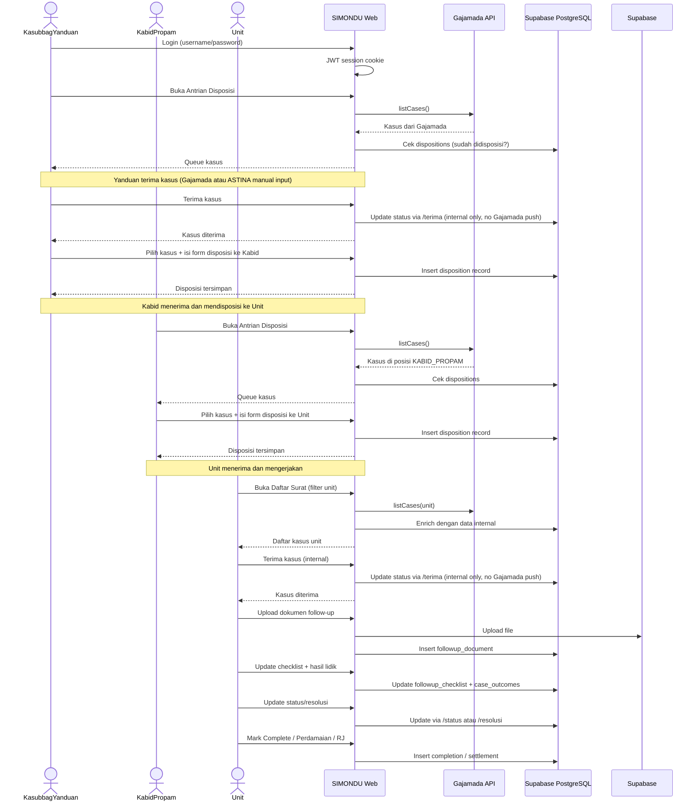
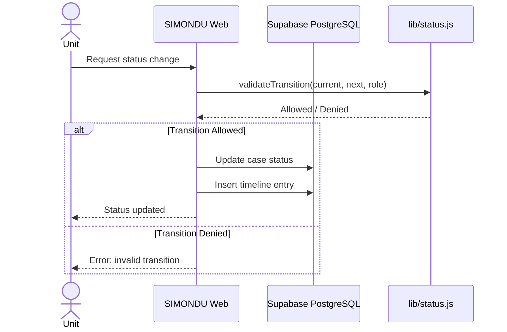
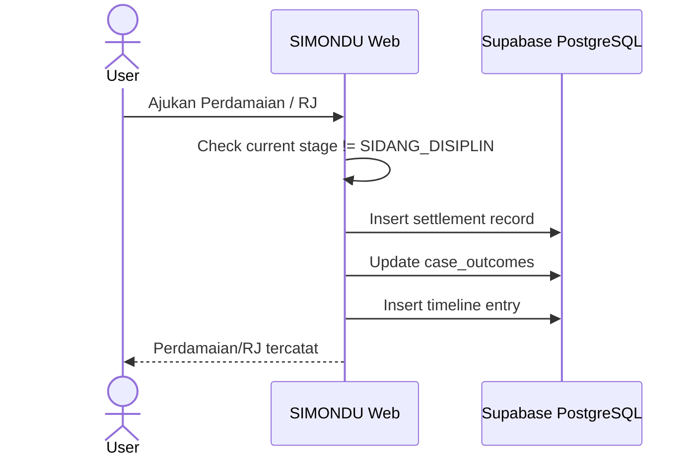
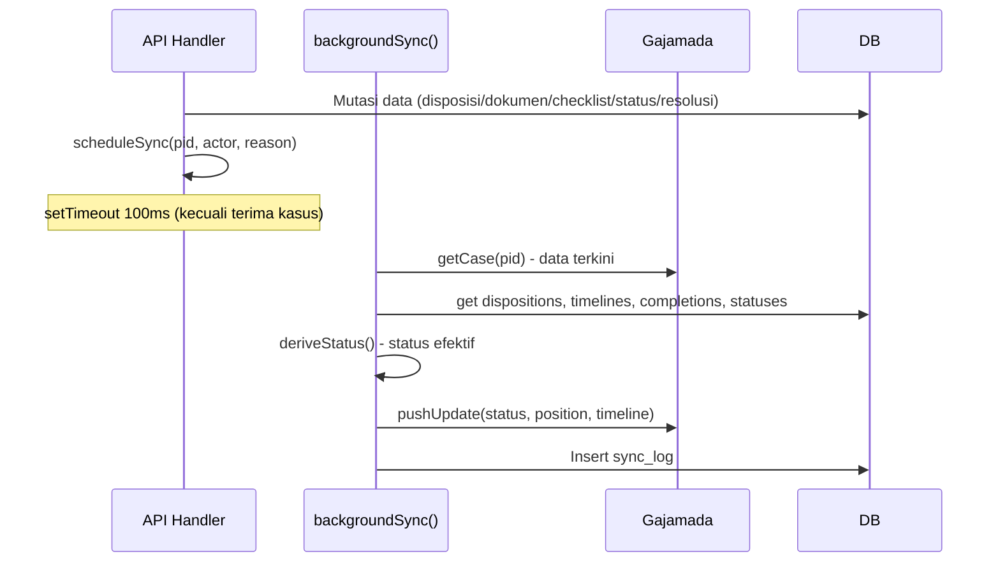

# Key flows

## Alur Disposisi (End-to-End)

Simplified flow: Yanduan terima -> Kabid disposisi -> Unit proses -> Selesai.

## Alur Status Transitions

## Alur Perdamaian / RJ

Perdamaian dan RJ dapat diajukan di **tahap mana pun** kecuali SIDANG_DISIPLIN.

## Alur Sinkronisasi Background

Fire-and-forget sync ke Gajamada untuk mutasi tertentu. **Terima kasus internal only** tidak memicu sync ke Gajamada.

