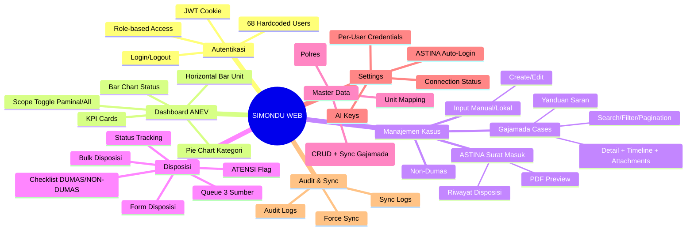

# Feature mindmap

```mermaid
mindmap
  root((SIMONDU WEB))
    Autentikasi
      Login/Logout
      JWT Cookie
      Role-based Access
      68 Hardcoded Users
    Dashboard ANEV
      KPI Cards
      Bar Chart Status
      Pie Chart Kategori
      Horizontal Bar Unit
      Scope Toggle Paminal/All
    Manajemen Kasus
      Gajamada Cases
        Search/Filter/Pagination
        Detail + Timeline + Attachments
        Yanduan Saran
      ASTINA Surat Masuk
        PDF Preview
        Riwayat Disposisi
      Input Manual/Lokal
        Create/Edit
      Non-Dumas
    Disposisi
      Queue 3 Sumber
      Form Disposisi
      Checklist DUMAS/NON-DUMAS
      ATENSI Flag
      Status Tracking
      Bulk Disposisi
    Master Data
      Unit (CRUD + Sync Gajamada)
      Satker/Satwil (Polres)
      Unit Mapping
    Settings
      Per-User Credentials
      Connection Status
      ASTINA Auto-Login
      AI Keys
    Audit & Sync
      Audit Logs
      Sync Logs
      Force Sync
```
