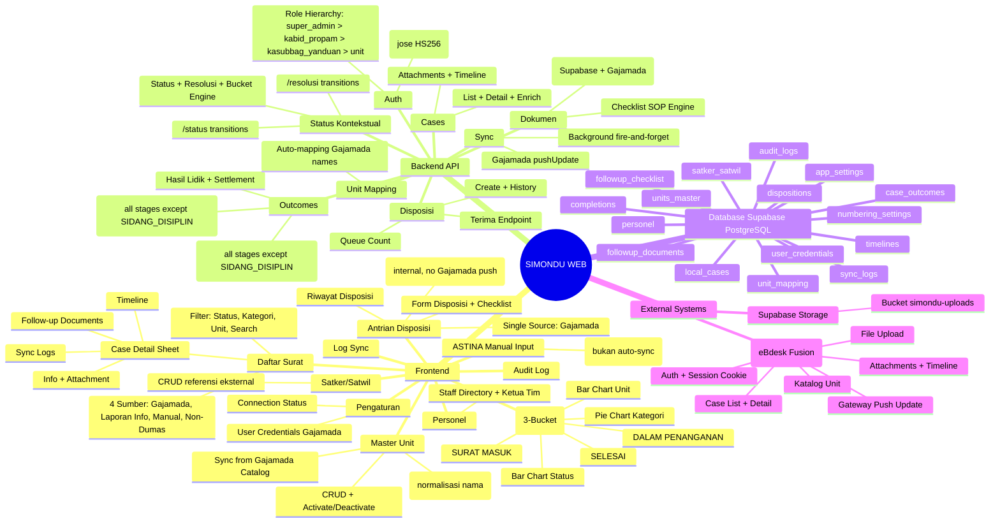

# Feature mindmap

```mermaid
mindmap
  root((SIMONDU WEB))
    Frontend
      Dashboard ANEV (3-Bucket)
        SURAT MASUK
        DALAM PENANGANAN
        SELESAI
        Bar Chart Status
        Pie Chart Kategori
        Bar Chart Unit
      Daftar Surat
        Filter: Status, Kategori, Unit, Search
        4 Sumber: Gajamada, Laporan Info, Manual, Non-Dumas
        Case Detail Sheet
          Info + Attachment
          Follow-up Documents
          Timeline
          Sync Logs
      Antrian Disposisi
        Single Source: Gajamada
        Form Disposisi + Checklist
        Riwayat Disposisi
        Terima (internal, no Gajamada push)
      Master Unit
        CRUD + Activate/Deactivate
        Sync from Gajamada Catalog
        Unit Mapping (normalisasi nama)
      Satker/Satwil
        CRUD referensi eksternal
      ASTINA Manual Input
        Input surat ASTINA manual (bukan auto-sync)
      Personel
        Staff Directory + Ketua Tim
      Log Sync
      Audit Log
      Pengaturan
        User Credentials Gajamada
        Connection Status
    Backend API
      Auth
        JWT Cookie (jose HS256)
        Role Hierarchy: super_admin > kabid_propam > kasubbag_yanduan > unit
      Cases
        List + Detail + Enrich
        Attachments + Timeline
      Disposisi
        Create + History
        Queue Count
        Terima Endpoint
      Status Kontekstual
        /status transitions
        /resolusi transitions
        Status + Resolusi + Bucket Engine
      Dokumen
        Upload Dual (Supabase + Gajamada)
        Checklist SOP Engine
      Outcomes
        Hasil Lidik + Settlement
        Perdamaian (all stages except SIDANG_DISIPLIN)
        RJ (all stages except SIDANG_DISIPLIN)
      Sync
        Background fire-and-forget
        Gajamada pushUpdate
      Unit Mapping
        Auto-mapping Gajamada names
    Database Supabase PostgreSQL
      dispositions
      timelines
      followup_documents
      sync_logs
      audit_logs
      units_master
      completions
      followup_checklist
      case_outcomes
      satker_satwil
      numbering_settings
      local_cases
      personel
      user_credentials
      app_settings
      unit_mapping
    External Systems
      Gajamada (eBdesk Fusion)
        Auth + Session Cookie
        Case List + Detail
        Attachments + Timeline
        Gateway Push Update
        File Upload
        Katalog Unit
      Supabase Storage
        Bucket simondu-uploads
```
