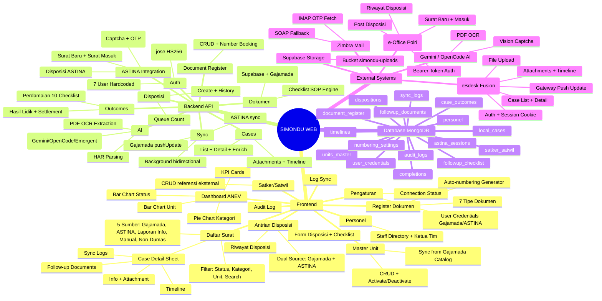

# Feature mindmap

```mermaid
mindmap
  root((SIMONDU WEB))
    Frontend
      Dashboard ANEV
        KPI Cards
        Bar Chart Status
        Pie Chart Kategori
        Bar Chart Unit
      Daftar Surat
        Filter: Status, Kategori, Unit, Search
        5 Sumber: Gajamada, ASTINA, Laporan Info, Manual, Non-Dumas
        Case Detail Sheet
          Info + Attachment
          Follow-up Documents
          Timeline
          Sync Logs
      Antrian Disposisi
        Dual Source: Gajamada + ASTINA
        Form Disposisi + Checklist
        Riwayat Disposisi
      Master Unit
        CRUD + Activate/Deactivate
        Sync from Gajamada Catalog
      Satker/Satwil
        CRUD referensi eksternal
      Register Dokumen
        7 Tipe Dokumen
        Auto-numbering Generator
      Personel
        Staff Directory + Ketua Tim
      Log Sync
      Audit Log
      Pengaturan
        User Credentials Gajamada/ASTINA
        Connection Status
    Backend API
      Auth
        JWT Cookie (jose HS256)
        7 User Hardcoded
      Cases
        List + Detail + Enrich
        Attachments + Timeline
      Disposisi
        Create + History
        Queue Count
      Dokumen
        Upload Dual (Supabase + Gajamada)
        Checklist SOP Engine
      Outcomes
        Hasil Lidik + Settlement
        Perdamaian 10-Checklist
      Sync
        Background bidirectional
        Gajamada pushUpdate
        ASTINA sync
      Document Register
        CRUD + Number Booking
      ASTINA Integration
        Auto-login (Captcha + OTP)
        Surat Baru + Surat Masuk
        Disposisi ASTINA
      AI
        Captcha Solving (Gemini/OpenCode/Emergent)
        PDF OCR Extraction
        HAR Parsing
    Database MongoDB
      dispositions
      timelines
      followup_documents
      sync_logs
      audit_logs
      units_master
      completions
      followup_checklist
      case_outcomes
      satker_satwil
      numbering_settings
      local_cases
      astina_sessions
      document_register
      personel
      user_credentials
    External Systems
      Gajamada (eBdesk Fusion)
        Auth + Session Cookie
        Case List + Detail
        Attachments + Timeline
        Gateway Push Update
        File Upload
      ASTINA (e-Office Polri)
        Bearer Token Auth
        Surat Baru + Masuk
        Riwayat Disposisi
        Post Disposisi
      Supabase Storage
        Bucket simondu-uploads
      Gemini / OpenCode AI
        Vision Captcha
        PDF OCR
      Zimbra Mail
        IMAP OTP Fetch
        SOAP Fallback
```
