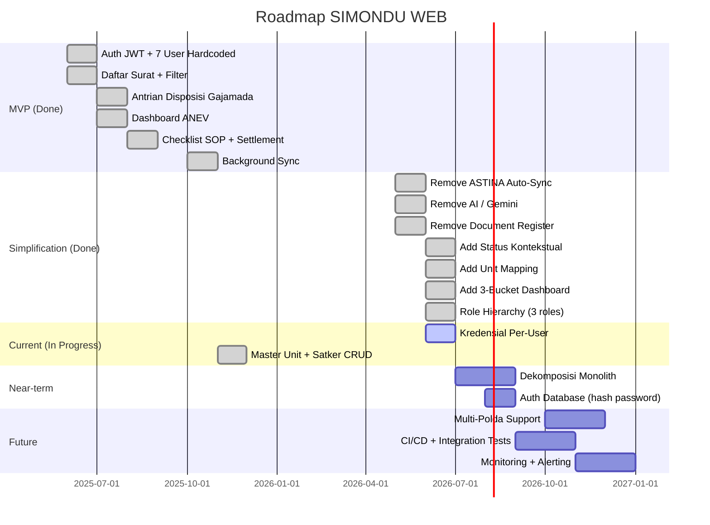

# Roadmap

## Milestone Terkini

## Rencana Dekat

- **Dekomposisi Monolith** ??? Pecah `page.js` (~2500 lines) dan `route.js` (~2000 lines) ke modul terpisah
- **Auth Database** ??? Pindahkan kredensial dari hardcoded ke database dengan bcrypt

## Rencana Jauh

- **Multi-Polda** ??? Dukungan deployment untuk Polda selain Jawa Barat
- **CI/CD Pipeline** ??? Automated testing + deployment
- **Monitoring** ??? Health check + alert untuk koneksi Gajamada
