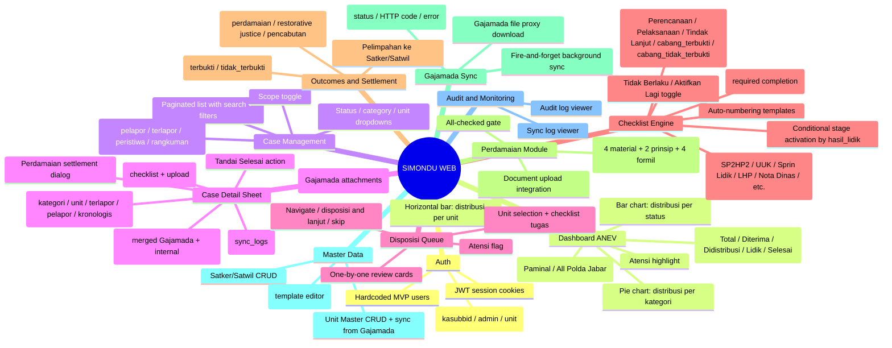

# Feature mindmap

## Feature map

```mermaid
mindmap
  root((SIMONDU WEB))
    Auth
      JWT session cookies
      Hardcoded MVP users
      Role-based UI (kasubbid / admin / unit)
    Dashboard ANEV
      KPI cards (Total / Diterima / Didistribusi / Lidik / Selesai)
      Bar chart: distribusi per status
      Pie chart: distribusi per kategori
      Horizontal bar: distribusi per unit
      Atensi highlight
      Scope toggle (Paminal / All Polda Jabar)
    Case Management
      Paginated list with search + filters
      Status / category / unit dropdowns
      Scope toggle
      Gajamada-style columns (pelapor / terlapor / peristiwa / rangkuman)
    Case Detail Sheet
      Info tab (kategori / unit / terlapor / pelapor / kronologis)
      Sumber tab (Gajamada attachments)
      Tindak Lanjut tab (checklist + upload)
      Timeline tab (merged Gajamada + internal)
      Sync tab (sync_logs)
      Perdamaian settlement dialog
      Tandai Selesai action
    Disposisi Queue
      One-by-one review cards
      Unit selection + checklist tugas
      Atensi flag
      Navigate / disposisi and lanjut / skip
    Checklist Engine
      5 SOP stages (Perencanaan / Pelaksanaan / Tindak Lanjut / cabang_terbukti / cabang_tidak_terbukti)
      15 document types (SP2HP2 / UUK / Sprin Lidik / LHP / Nota Dinas / etc.)
      Conditional stage activation by hasil_lidik
      Auto-numbering templates
      Tidak Berlaku / Aktifkan Lagi toggle
      Progress bar (required completion)
    Outcomes and Settlement
      Hasil Lidik (terbukti / tidak_terbukti)
      Pelimpahan ke Satker/Satwil
      Settlement paths (perdamaian / restorative justice / pencabutan)
    Perdamaian Module
      10-item checklist (4 material + 2 prinsip + 4 formil)
      All-checked gate
      Document upload integration
    Gajamada Sync
      Fire-and-forget background sync
      Sync log viewer (status / HTTP code / error)
      Gajamada file proxy download
    Master Data
      Unit Master CRUD + sync from Gajamada
      Satker/Satwil CRUD
      Numbering settings (template editor)
    Audit and Monitoring
      Audit log viewer
      Sync log viewer
```
