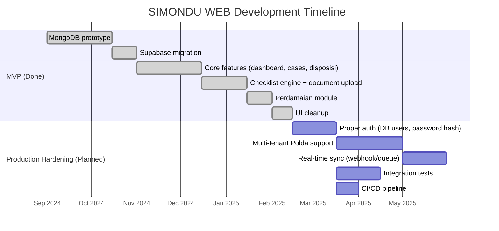

# Roadmap

## Roadmap

## Current state

**MVP deployed and operational.** The application is in active use by Subbid Paminal Polda Jabar personnel for daily case management. All core workflows (listing, disposition, checklist, settlement, sync) are functional.

## Known limitations (low-confidence ??? confirm with team)

- **Hardcoded credentials** ??? user accounts in `auth.js`; no password change, no account provisioning UI
- **No integration tests** ??? only a Python smoke test (`backend_test.py`); manual testing only
- **Single Polda deployment** ??? filtered to `POLDA JAWA BARAT` in Gajamada queries; would need multi-tenancy for other regions
- **Fire-and-forget sync** ??? background sync has no retry queue; failures are only visible in sync_logs viewer
- **No monitoring/alerting** ??? no health checks, no error alerting, no uptime tracking
- **Single-file monolith** ??? `page.js` (1657 lines) and `route.js` (892 lines) would benefit from decomposition before adding features
